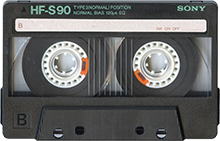

[](https://ci.appveyor.com/project/drewnoakes/cassette)
[](https://www.nuget.org/packages/DrewNoakes.Cassette/)
[](https://www.nuget.org/packages/DrewNoakes.Cassette/)

Cassette is a simple and efficient content-addressable storage system for .NET 4.5.

```csharp
// Create a store, backed by the specified file system location
var cassette = new ContentAddressableStore(@"c:\cassette-data\");

// Store some content, obtaining its hash (content address)
byte[] hash = await cassette.WriteAsync(writeStream);

// Later, use the hash to look up the content
Stream readStream;
if (cassette.TryRead(hash, out readStream, ReadOptions.Asychronous | ReadOptions.SequentialScan))
{
    using (readStream)
    {
        // Read the stored content via the returned read-only stream
        var buffer = new byte[4096];
        var bytesWritten = await readStream.ReadAsync(buffer, 0, buffer.Length);
        // ...
    }
}
```

Content-addressable storage (CAS) is a fast and efficient mechanism for storing and retrieving fixed data on disk.

Information is uniquely and unambiguously identified by the SHA-1 hash of its contents.

A significant advantage of CAS is its efficient use of storage media for data backups where a majority of files are identical, and so separate storage would be redundant.

For more information, read [Wikipedia's CAS article](http://en.wikipedia.org/wiki/Content-addressable_storage).

---

## Types

* `IContentAddressableStore` exposes functionality of a cassette store
* `ContentAddressableStore` is the concrete implementation
* `Hash` is a static class with useful methods for working with hashes

## Addresses

Content is addressed via its SHA-1 hash. The API accepts and returns hash values as `byte[]` for minimal representation in memory.

The `Hash` class provides convenient utilities for working with hashes:

* `Hash.Format` convert from `byte[]` to `string`
* `Hash.Parse` and `Hash.TryParse` convert from `string` to `byte[]`
* `Hash.IsValid` validates hashes
* `Hash.Compute` computes the hash for some content
* `Hash.Equals` compares two hashes for equality

## Writing content

```csharp
using (var stream = File.OpenRead(@"c:\content.jpg"))
{
    var hash = await store.WriteAsync(dataStream);
    Console.WriteLine("Stored with address: {0}", Hash.Format(hash));
}
```

The hash is computed efficiently by observing content during buffered writes to a temporary location of the file system. Then:

* if the content does not already exist, the file is atomically moved into location and marked as read-only
* if the content does already exist, the temporary file is deleted and the store is unchanged

This means writes are idempotent. Repeated writes of the same content do not increase the size of the store on disk, though do incur disk IO.

## Reading

Read operations atomically test for the availability of a file and open it for reading if present.

Multiple clients may read a file concurrently. Content may not be deleted via `IContentAddressableStore.Delete` while a read stream is open.

When `TryRead` returns `true`, client code must dispose the returned `Stream`.

```csharp
byte[] hash = ...;
Stream stream;
if (store.TryRead(hash, out stream))
{
    using (stream)
    {
        // Use the stream
    }
}
```

The performance of reads can be improved by specifying `ReadOptions` as described in sections [async IO](#Asynchronous-IO) and [access patterns and performance](#Access-patterns-and-performance).

* `None` indicates no special options. This is the default.
* `SequentialScan` indicates data will be read sequentially.
* `RandomAccess` indicates seek operations will be performed during reading.
* `Asynchronous` indicates `Stream.ReadAsync` will be used.

```csharp
TryRead(hash, out stream,
    ReadOptions.SequentialScan | ReadOptions.ReadAsync)
```

## Asynchronous IO

Write operations happen using asynchronous IO and return awaitable tasks to prevent blocking calling code. Use of a `CancellationToken` allows immediate cancellation of the write operation.

Read operations occur using `Stream`s which support asynchronous IO themselves via `ReadAsync` and `CopyToAsync`. When using these asynchronous methods you can improve performance by passing `ReadOptions.Asynchronous` to `IContentAddressableStore.TryRead`.

On Windows these asynchronous operations use IO Completion ports ([MSDN](https://msdn.microsoft.com/en-us/library/windows/desktop/aa365198(v=vs.85).aspx), [Dr. Dobbs](http://www.drdobbs.com/cpp/multithreaded-asynchronous-io-io-comple/201202921)). Other platforms may have implementations using suitable alternatives.

## Access patterns and performance

When writing content to disk, cassette notifies the file system that data will be written sequentially and that no random-access seeking will occur. This allows the caching system to prepare pages of data efficiently which can significantly reduce latency.

When reading content from disk, users can get the same caching benefits by specifying `ReadOptions.SequentialScan` or `ReadOptions.RandomAccess`. This is optional however.

## Deleting content

Content may be deleted from the store by calling `Delete` with the relevant hash.

## Measuring content length

If the length of stored content is to be retrieved, it is most efficient to use `TryGetContentLength` which provides the length in bytes.

## Enumerating content

The complete set of hashes is returned via `GetHashes`. This method computes the enumerable lazily by walking the file system so is thread-safe with respect to reads and writes. However it cannot be relied upon to behave deterministically if enumerating while content is being written or deleted. Whether new or deleted content is included in an enumeration whose processing spans the write/delete may or may not contain the affected content.
